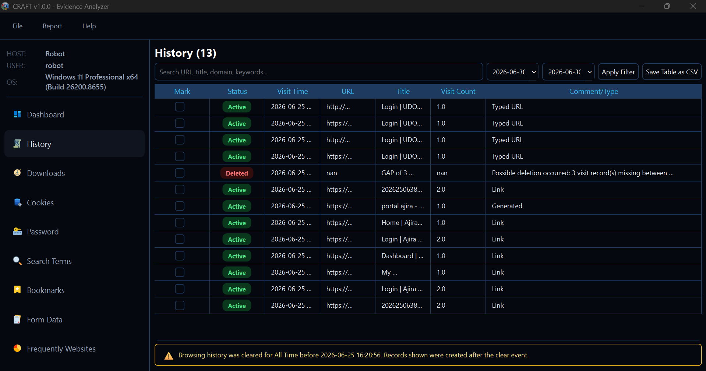

# CRAFT - Cross-Browser Artifact Forensics Tool
A forensic tool for web browser analysis that can extract, analyze, and report browser artifacts to support digital forensic investigations. It's Browser history extractor and analyzer for Windows - parses browsing history, cookies, downloads and browser artifacts from Live machines into a timestamped CSV.

  

# Project Summary
Web browsers store a wealth of information that can be invaluable in investigations, including browsing history, downloaded files, and cookies. BrowserForensicsToolkit simplifies the process of extracting and analyzing this data from major browsers like:

---

## Supported Browsers

| Browser | Path Scanned |
|---|---|
| Google Chrome | `AppData\Local\Google\Chrome\User Data\Default` |
| Microsoft Edge | `AppData\Local\Microsoft\Edge\User Data\Default` |
| Opera | `AppData\Roaming\Opera Software\Opera Stable\Default` |
| Mozilla Firefox| `AppData\Roaming\Mozilla\Firefox\Profiles` |

---

## Key Forensic Features

**Multi-browser, multi-profile** — Automatically discovers all browser profiles across all Windows user accounts under the scanned path. Each entry is tagged with the Windows username.

**Deleted history detection** — `CLEARED_GAP` entries identify gaps in internal visit ID sequence. A gap of N means N visit records were deleted. The timestamp range shows when the deletion likely occurred.

---

